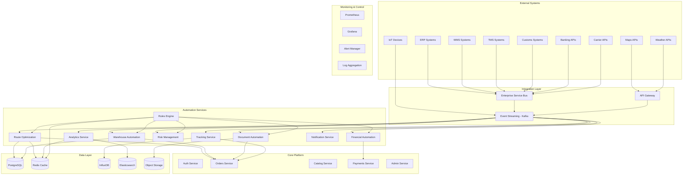
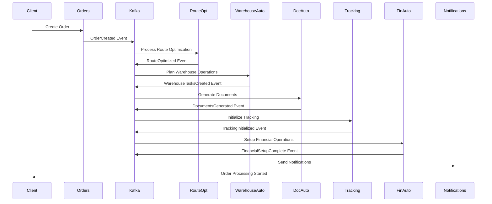

# Design Document

## Overview

Этот документ описывает архитектуру системы полной автоматизации логистики, которая расширяет существующую платформу маркетплейса логистических услуг. Система обеспечивает end-to-end автоматизацию всех логистических процессов через правила, алгоритмы, интеграции и автоматические процессы без использования AI/ML компонентов.

### Архитектурные принципы

1. **Event-Driven Architecture** - все процессы запускаются событиями
2. **Rule-Based Automation** - решения принимаются на основе настраиваемых правил
3. **Microservices** - каждый домен автоматизации - отдельный сервис
4. **Real-time Processing** - обработка данных в реальном времени
5. **Integration-First** - максимальная интеграция с внешними системами
6. **Fault Tolerance** - устойчивость к сбоям и автоматическое восстановление

## Architecture

### High-Level Architecture



### Event-Driven Processing Flow



## Components and Interfaces

### 1. Route Optimization Service

**Responsibilities:**
- Автоматическое планирование оптимальных маршрутов
- Мультимодальная оптимизация
- Консолидация грузов
- Динамическое перепланирование

**Key Algorithms:**
- Dijkstra's algorithm для кратчайшего пути
- Vehicle Routing Problem (VRP) решения
- Bin packing для консолидации
- Time window optimization

**API Endpoints:**
```
POST /api/v1/routes/optimize
GET  /api/v1/routes/{route_id}
PUT  /api/v1/routes/{route_id}/reoptimize
POST /api/v1/routes/consolidate
GET  /api/v1/routes/alternatives/{route_id}
```

**Database Schema:**
```sql
CREATE TABLE optimized_routes (
    id UUID PRIMARY KEY,
    order_id UUID REFERENCES orders(id),
    origin_point JSONB NOT NULL,
    destination_point JSONB NOT NULL,
    waypoints JSONB[],
    transport_modes VARCHAR[],
    estimated_duration INTEGER, -- minutes
    estimated_distance INTEGER, -- meters
    estimated_cost DECIMAL(12,2),
    carbon_footprint DECIMAL(10,3),
    optimization_criteria JSONB, -- cost, time, eco, etc.
    constraints JSONB, -- weight, dimensions, hazmat
    status VARCHAR(20) DEFAULT 'active',
    created_at TIMESTAMP DEFAULT NOW(),
    updated_at TIMESTAMP DEFAULT NOW()
);

CREATE TABLE route_segments (
    id UUID PRIMARY KEY,
    route_id UUID REFERENCES optimized_routes(id),
    sequence_number INTEGER,
    transport_mode VARCHAR(50),
    origin_point JSONB,
    destination_point JSONB,
    carrier_id UUID,
    estimated_duration INTEGER,
    estimated_cost DECIMAL(12,2),
    status VARCHAR(20) DEFAULT 'planned'
);
```

### 2. Warehouse Automation Service

**Responsibilities:**
- Автоматическое размещение товаров
- Оптимизация комплектации
- Управление инвентаризацией
- Интеграция с WMS системами

**Key Features:**
- FIFO/FEFO автоматическое применение
- Зонирование склада по типам товаров
- Автоматическое создание задач для персонала/роботов
- Оптимизация маршрутов комплектации

**API Endpoints:**
```
POST /api/v1/warehouse/inbound
POST /api/v1/warehouse/outbound
GET  /api/v1/warehouse/inventory
POST /api/v1/warehouse/optimize-placement
GET  /api/v1/warehouse/picking-tasks
POST /api/v1/warehouse/cycle-count
```

**Database Schema:**
```sql
CREATE TABLE warehouse_zones (
    id UUID PRIMARY KEY,
    warehouse_id UUID,
    zone_code VARCHAR(10),
    zone_type VARCHAR(50), -- storage, picking, staging, shipping
    capacity_cbm DECIMAL(10,3),
    temperature_controlled BOOLEAN DEFAULT FALSE,
    hazmat_allowed BOOLEAN DEFAULT FALSE,
    automated BOOLEAN DEFAULT FALSE
);

CREATE TABLE inventory_locations (
    id UUID PRIMARY KEY,
    warehouse_id UUID,
    zone_id UUID REFERENCES warehouse_zones(id),
    location_code VARCHAR(20),
    product_id UUID,
    quantity INTEGER,
    reserved_quantity INTEGER DEFAULT 0,
    expiry_date DATE,
    batch_number VARCHAR(50),
    last_movement TIMESTAMP DEFAULT NOW()
);

CREATE TABLE warehouse_tasks (
    id UUID PRIMARY KEY,
    task_type VARCHAR(20), -- inbound, outbound, move, count
    priority INTEGER DEFAULT 5,
    order_id UUID,
    product_id UUID,
    from_location VARCHAR(20),
    to_location VARCHAR(20),
    quantity INTEGER,
    assigned_to VARCHAR(50), -- worker_id or robot_id
    status VARCHAR(20) DEFAULT 'pending',
    created_at TIMESTAMP DEFAULT NOW(),
    completed_at TIMESTAMP
);
```

### 3. Document Automation Service

**Responsibilities:**
- Автоматическая генерация всех документов
- Интеграция с таможенными системами
- Электронный документооборот
- Автоматическое заполнение форм

**Document Types:**
- Коммерческие документы (инвойсы, упаковочные листы)
- Транспортные документы (CMR, коносаменты, авианакладные)
- Таможенные документы (декларации, сертификаты)
- Страховые документы
- Документы соответствия

**API Endpoints:**
```
POST /api/v1/documents/generate
GET  /api/v1/documents/{doc_id}
POST /api/v1/documents/submit-customs
GET  /api/v1/documents/templates
PUT  /api/v1/documents/templates/{template_id}
POST /api/v1/documents/batch-generate
```

**Database Schema:**
```sql
CREATE TABLE document_templates (
    id UUID PRIMARY KEY,
    template_name VARCHAR(100),
    document_type VARCHAR(50),
    template_content JSONB, -- template structure
    required_fields JSONB[], -- list of required data fields
    output_format VARCHAR(10) DEFAULT 'PDF',
    language VARCHAR(5) DEFAULT 'ru',
    version INTEGER DEFAULT 1,
    is_active BOOLEAN DEFAULT TRUE
);

CREATE TABLE generated_documents (
    id UUID PRIMARY KEY,
    order_id UUID REFERENCES orders(id),
    template_id UUID REFERENCES document_templates(id),
    document_type VARCHAR(50),
    document_number VARCHAR(50),
    file_path VARCHAR(255),
    file_hash VARCHAR(64),
    data_used JSONB, -- actual data used for generation
    status VARCHAR(20) DEFAULT 'generated',
    generated_at TIMESTAMP DEFAULT NOW(),
    submitted_at TIMESTAMP,
    approved_at TIMESTAMP
);

CREATE TABLE customs_submissions (
    id UUID PRIMARY KEY,
    order_id UUID REFERENCES orders(id),
    declaration_number VARCHAR(50),
    customs_office VARCHAR(50),
    submission_type VARCHAR(30), -- import, export, transit
    documents UUID[], -- array of document IDs
    status VARCHAR(30) DEFAULT 'submitted',
    submitted_at TIMESTAMP DEFAULT NOW(),
    processed_at TIMESTAMP,
    customs_response JSONB
);
```

### 4. Enhanced Tracking Service

**Responsibilities:**
- Интеграция с IoT устройствами
- Обработка телеметрических данных
- Автоматические уведомления о событиях
- Мониторинг условий перевозки

**IoT Data Processing:**
- GPS координаты каждые 30 секунд
- Температура и влажность для рефрижераторов
- Датчики вскрытия и вибрации
- Диагностические данные транспорта

**API Endpoints:**
```
POST /api/v1/tracking/iot-data
GET  /api/v1/tracking/orders/{order_id}/live
POST /api/v1/tracking/geofences
GET  /api/v1/tracking/alerts
POST /api/v1/tracking/milestones
```

**Database Schema:**
```sql
CREATE TABLE iot_devices (
    id UUID PRIMARY KEY,
    device_id VARCHAR(50) UNIQUE,
    device_type VARCHAR(30), -- gps, temperature, door, vibration
    order_id UUID REFERENCES orders(id),
    vehicle_id UUID,
    container_id VARCHAR(50),
    is_active BOOLEAN DEFAULT TRUE,
    last_heartbeat TIMESTAMP,
    battery_level INTEGER,
    configuration JSONB
);

-- Time-series data stored in InfluxDB
-- CREATE TABLE tracking_data (
--     time TIMESTAMP,
--     device_id VARCHAR(50),
--     order_id UUID,
--     latitude DECIMAL(10,8),
--     longitude DECIMAL(11,8),
--     temperature DECIMAL(5,2),
--     humidity DECIMAL(5,2),
--     vibration_level DECIMAL(6,3),
--     door_status BOOLEAN,
--     speed INTEGER,
--     fuel_level DECIMAL(5,2)
-- );

CREATE TABLE geofences (
    id UUID PRIMARY KEY,
    name VARCHAR(100),
    center_lat DECIMAL(10,8),
    center_lng DECIMAL(11,8),
    radius_meters INTEGER,
    fence_type VARCHAR(20), -- pickup, delivery, restricted
    order_id UUID REFERENCES orders(id),
    is_active BOOLEAN DEFAULT TRUE
);

CREATE TABLE tracking_alerts (
    id UUID PRIMARY KEY,
    order_id UUID REFERENCES orders(id),
    device_id VARCHAR(50),
    alert_type VARCHAR(30), -- deviation, temperature, door, delay
    severity VARCHAR(10), -- low, medium, high, critical
    message TEXT,
    alert_data JSONB,
    acknowledged BOOLEAN DEFAULT FALSE,
    created_at TIMESTAMP DEFAULT NOW(),
    acknowledged_at TIMESTAMP
);
```

### 5. Risk Management Service

**Responsibilities:**
- Автоматическая оценка рисков
- Применение мер безопасности
- Мониторинг инцидентов
- Страховое покрытие

**Risk Assessment Matrix:**
- Географические риски (регионы, маршруты)
- Грузовые риски (стоимость, тип груза)
- Временные риски (сезонность, праздники)
- Транспортные риски (вид транспорта, перевозчик)

**API Endpoints:**
```
POST /api/v1/risk/assess
GET  /api/v1/risk/matrix
POST /api/v1/risk/incidents
GET  /api/v1/risk/reports
PUT  /api/v1/risk/mitigation-plans
```

**Database Schema:**
```sql
CREATE TABLE risk_factors (
    id UUID PRIMARY KEY,
    factor_name VARCHAR(100),
    factor_type VARCHAR(30), -- geographic, cargo, temporal, transport
    risk_level INTEGER, -- 1-10 scale
    mitigation_actions JSONB[],
    is_active BOOLEAN DEFAULT TRUE
);

CREATE TABLE risk_assessments (
    id UUID PRIMARY KEY,
    order_id UUID REFERENCES orders(id),
    total_risk_score INTEGER,
    risk_factors JSONB[], -- applied risk factors
    recommended_actions JSONB[],
    insurance_required BOOLEAN DEFAULT FALSE,
    insurance_amount DECIMAL(12,2),
    assessed_at TIMESTAMP DEFAULT NOW()
);

CREATE TABLE security_incidents (
    id UUID PRIMARY KEY,
    order_id UUID REFERENCES orders(id),
    incident_type VARCHAR(50),
    severity VARCHAR(10),
    description TEXT,
    location JSONB,
    reported_by VARCHAR(100),
    status VARCHAR(20) DEFAULT 'open',
    resolution TEXT,
    created_at TIMESTAMP DEFAULT NOW(),
    resolved_at TIMESTAMP
);
```

### 6. Financial Automation Service

**Responsibilities:**
- Автоматическое выставление счетов
- Расчет дополнительных услуг
- Валютные операции
- Налоговые расчеты

**Automated Calculations:**
- Базовая стоимость по тарифам
- Топливные надбавки
- Дополнительные услуги
- Штрафы и пени
- Налоги и пошлины

**API Endpoints:**
```
POST /api/v1/finance/calculate-cost
POST /api/v1/finance/generate-invoice
GET  /api/v1/finance/exchange-rates
POST /api/v1/finance/tax-calculation
GET  /api/v1/finance/profitability/{order_id}
```

**Database Schema:**
```sql
CREATE TABLE cost_calculations (
    id UUID PRIMARY KEY,
    order_id UUID REFERENCES orders(id),
    base_cost DECIMAL(12,2),
    fuel_surcharge DECIMAL(12,2),
    additional_services JSONB, -- {service_name: cost}
    taxes DECIMAL(12,2),
    duties DECIMAL(12,2),
    penalties DECIMAL(12,2),
    total_cost DECIMAL(12,2),
    currency VARCHAR(3),
    calculation_rules JSONB,
    calculated_at TIMESTAMP DEFAULT NOW()
);

CREATE TABLE automated_invoices (
    id UUID PRIMARY KEY,
    order_id UUID REFERENCES orders(id),
    invoice_number VARCHAR(50),
    client_id UUID,
    supplier_id UUID,
    amount DECIMAL(12,2),
    currency VARCHAR(3),
    tax_amount DECIMAL(12,2),
    due_date DATE,
    status VARCHAR(20) DEFAULT 'generated',
    generated_at TIMESTAMP DEFAULT NOW(),
    sent_at TIMESTAMP,
    paid_at TIMESTAMP
);

CREATE TABLE exchange_rates (
    id UUID PRIMARY KEY,
    from_currency VARCHAR(3),
    to_currency VARCHAR(3),
    rate DECIMAL(10,6),
    source VARCHAR(50), -- cbr, ecb, etc.
    valid_from TIMESTAMP,
    valid_until TIMESTAMP,
    created_at TIMESTAMP DEFAULT NOW()
);
```

### 7. Rules Engine

**Responsibilities:**
- Централизованное управление бизнес-правилами
- Динамическое применение правил
- A/B тестирование правил
- Аудит применения правил

**Rule Types:**
- Routing rules (выбор маршрута)
- Pricing rules (ценообразование)
- Risk rules (управление рисками)
- Warehouse rules (складские операции)
- Notification rules (уведомления)

**API Endpoints:**
```
POST /api/v1/rules/evaluate
GET  /api/v1/rules/categories
POST /api/v1/rules/create
PUT  /api/v1/rules/{rule_id}
GET  /api/v1/rules/audit-log
```

**Database Schema:**
```sql
CREATE TABLE business_rules (
    id UUID PRIMARY KEY,
    rule_name VARCHAR(100),
    rule_category VARCHAR(50),
    rule_description TEXT,
    conditions JSONB, -- rule conditions in JSON format
    actions JSONB, -- actions to take when rule matches
    priority INTEGER DEFAULT 100,
    is_active BOOLEAN DEFAULT TRUE,
    version INTEGER DEFAULT 1,
    created_by UUID,
    created_at TIMESTAMP DEFAULT NOW(),
    updated_at TIMESTAMP DEFAULT NOW()
);

CREATE TABLE rule_executions (
    id UUID PRIMARY KEY,
    rule_id UUID REFERENCES business_rules(id),
    order_id UUID,
    input_data JSONB,
    rule_matched BOOLEAN,
    actions_taken JSONB,
    execution_time_ms INTEGER,
    executed_at TIMESTAMP DEFAULT NOW()
);

CREATE TABLE rule_sets (
    id UUID PRIMARY KEY,
    set_name VARCHAR(100),
    rule_ids UUID[],
    execution_order INTEGER[],
    is_active BOOLEAN DEFAULT TRUE
);
```

## Error Handling

### Automated Error Recovery

**Circuit Breaker Pattern:**
```python
class AutomationCircuitBreaker:
    def __init__(self, failure_threshold=5, recovery_timeout=60):
        self.failure_threshold = failure_threshold
        self.recovery_timeout = recovery_timeout
        self.failure_count = 0
        self.last_failure_time = None
        self.state = 'CLOSED'  # CLOSED, OPEN, HALF_OPEN
    
    async def call(self, func, *args, **kwargs):
        if self.state == 'OPEN':
            if time.time() - self.last_failure_time > self.recovery_timeout:
                self.state = 'HALF_OPEN'
            else:
                raise CircuitBreakerOpenError()
        
        try:
            result = await func(*args, **kwargs)
            if self.state == 'HALF_OPEN':
                self.state = 'CLOSED'
                self.failure_count = 0
            return result
        except Exception as e:
            self.failure_count += 1
            self.last_failure_time = time.time()
            
            if self.failure_count >= self.failure_threshold:
                self.state = 'OPEN'
            
            raise e
```

**Retry Mechanisms:**
```python
@retry(
    stop=stop_after_attempt(3),
    wait=wait_exponential(multiplier=1, min=4, max=10),
    retry=retry_if_exception_type((ConnectionError, TimeoutError))
)
async def call_external_api(endpoint, data):
    # External API call with automatic retry
    pass
```

### Fallback Strategies

1. **Route Optimization Fallback:**
   - Primary: Advanced optimization algorithms
   - Fallback: Simple shortest path calculation
   - Emergency: Manual route assignment

2. **Document Generation Fallback:**
   - Primary: Automated template generation
   - Fallback: Pre-filled template forms
   - Emergency: Manual document creation

3. **IoT Data Processing Fallback:**
   - Primary: Real-time IoT data
   - Fallback: Periodic manual updates
   - Emergency: Estimated positions based on schedule

## Testing Strategy

### Automated Testing Framework

**Unit Tests:**
- Business rule evaluation
- Algorithm correctness
- Data validation
- Error handling

**Integration Tests:**
- External API integrations
- Database operations
- Event processing
- Service communication

**End-to-End Automation Tests:**
- Complete order lifecycle automation
- Multi-modal route optimization
- Document generation and submission
- Financial calculation accuracy

**Performance Tests:**
- Route optimization under load
- Real-time data processing capacity
- Rule engine performance
- Database query optimization

**Chaos Engineering:**
- Service failure simulation
- Network partition testing
- Database failover testing
- External API unavailability

## Security Considerations

### Automated Security Measures

**Data Protection:**
- Automatic encryption of sensitive data
- Key rotation automation
- Access log monitoring
- Data retention policy enforcement

**API Security:**
- Automated rate limiting
- Request validation
- Authentication token management
- Audit trail generation

**Integration Security:**
- Certificate management automation
- VPN connection monitoring
- Firewall rule automation
- Security patch management

### Compliance Automation

**Regulatory Compliance:**
- Automatic compliance checking
- Regulatory change monitoring
- Audit report generation
- Policy enforcement automation

**Data Privacy:**
- GDPR compliance automation
- Data anonymization
- Consent management
- Right to erasure automation

This design provides a comprehensive foundation for full logistics automation while maintaining reliability, scalability, and security without relying on AI/ML components.