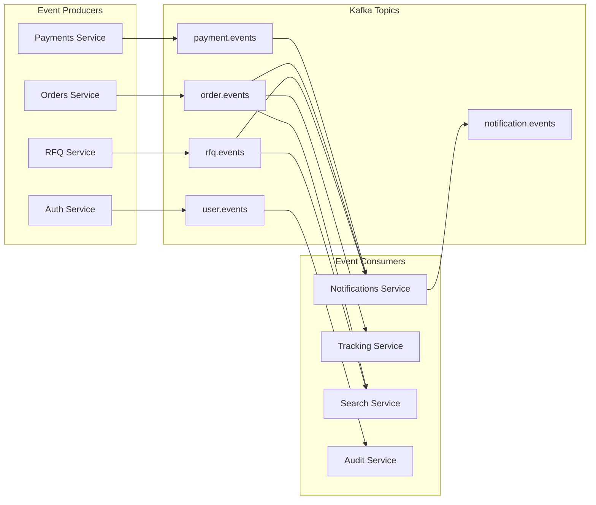

# Design Document

## Overview

This design document outlines the completion and enhancement of the existing B2B/B2C logistics marketplace platform. The system follows a microservices architecture with FastAPI backends, React frontend, and Flutter mobile application. The platform connects shippers with logistics providers across multiple transportation modes while ensuring security, scalability, and regulatory compliance.

### Current State Analysis

The existing implementation includes:
- **Backend Services**: 14 microservices (auth, orders, rfq, catalog, payments, etc.)
- **Frontend**: React TypeScript application with basic routing and state management
- **Mobile**: Flutter application structure (placeholder)
- **Infrastructure**: Docker Compose setup with PostgreSQL, Redis, Kafka, Elasticsearch, MinIO
- **Security**: Basic JWT authentication, RBAC matrix defined

### Missing Components to Implement

1. **Enhanced Security**: 2FA, rate limiting, audit logging, KYC verification
2. **Advanced Features**: Real-time tracking, document management, escrow payments
3. **Communication**: Chat system, dispute resolution, notifications
4. **Search & Analytics**: Full-text search, advanced filtering, reporting
5. **Mobile Application**: Complete Flutter implementation
6. **DevOps**: CI/CD pipelines, monitoring, observability

## Architecture

### High-Level Architecture

```mermaid
graph TB
    subgraph "Client Layer"
        WEB[React Web App]
        MOB[Flutter Mobile App]
        API_GW[API Gateway/Nginx]
    end
    
    subgraph "Application Layer"
        AUTH[Auth Service]
        ORGS[Organizations Service]
        CATALOG[Catalog Service]
        RFQ[RFQ Service]
        ORDERS[Orders Service]
        PAYMENTS[Payments Service]
        TRACKING[Tracking Service]
        DOCS[Documents Service]
        CHAT[Chat Service]
        DISPUTES[Disputes Service]
        NOTIFICATIONS[Notifications Service]
        SEARCH[Search Service]
        ADMIN[Admin Service]
        PRICING[Pricing Service]
    end
    
    subgraph "Data Layer"
        PG[(PostgreSQL)]
        REDIS[(Redis)]
        ES[(Elasticsearch)]
        MINIO[(MinIO S3)]
        KAFKA[Kafka]
    end
    
    subgraph "External Services"
        SMS[SMS Provider]
        EMAIL[Email Provider]
        MAPS[Maps API]
        PAYMENT_GW[Payment Gateway]
    end
    
    WEB --> API_GW
    MOB --> API_GW
    API_GW --> AUTH
    API_GW --> ORGS
    API_GW --> CATALOG
    API_GW --> RFQ
    API_GW --> ORDERS
    API_GW --> PAYMENTS
    API_GW --> TRACKING
    API_GW --> DOCS
    API_GW --> CHAT
    API_GW --> DISPUTES
    API_GW --> NOTIFICATIONS
    API_GW --> SEARCH
    API_GW --> ADMIN
    API_GW --> PRICING
    
    AUTH --> PG
    AUTH --> REDIS
    ORGS --> PG
    CATALOG --> PG
    RFQ --> PG
    RFQ --> KAFKA
    ORDERS --> PG
    ORDERS --> KAFKA
    PAYMENTS --> PG
    PAYMENTS --> KAFKA
    TRACKING --> PG
    TRACKING --> KAFKA
    DOCS --> PG
    DOCS --> MINIO
    CHAT --> PG
    DISPUTES --> PG
    NOTIFICATIONS --> PG
    NOTIFICATIONS --> KAFKA
    SEARCH --> ES
    ADMIN --> PG
    PRICING --> PG
    PRICING --> REDIS
    
    NOTIFICATIONS --> SMS
    NOTIFICATIONS --> EMAIL
    TRACKING --> MAPS
    PAYMENTS --> PAYMENT_GW
```



### Service Communication Patterns

1. **Synchronous Communication**: REST APIs for direct service-to-service calls
2. **Asynchronous Communication**: Kafka events for loose coupling
3. **Data Consistency**: Event sourcing for critical business events
4. **Caching**: Redis for session management, rate limiting, and frequently accessed data

### Event-Driven Architecture



## Components and Interfaces

### Enhanced Authentication Service

**New Features to Implement:**
- Two-Factor Authentication (TOTP)
- Rate limiting and brute force protection
- Session management with Redis
- Password policy enforcement
- Account lockout mechanisms

**API Endpoints:**
```
POST /api/v1/auth/register
POST /api/v1/auth/login
POST /api/v1/auth/logout
POST /api/v1/auth/refresh
POST /api/v1/auth/enable-2fa
POST /api/v1/auth/verify-2fa
POST /api/v1/auth/reset-password
GET  /api/v1/auth/sessions
DELETE /api/v1/auth/sessions/{session_id}
```

**Database Schema Enhancements:**
```sql
-- Add to existing users table
ALTER TABLE users ADD COLUMN failed_login_attempts INTEGER DEFAULT 0;
ALTER TABLE users ADD COLUMN locked_until TIMESTAMP;
ALTER TABLE users ADD COLUMN password_changed_at TIMESTAMP;

-- New table for active sessions
CREATE TABLE user_sessions (
    id UUID PRIMARY KEY,
    user_id UUID REFERENCES users(id),
    token_hash VARCHAR(255),
    ip_address INET,
    user_agent TEXT,
    created_at TIMESTAMP DEFAULT NOW(),
    expires_at TIMESTAMP,
    is_active BOOLEAN DEFAULT TRUE
);

-- Rate limiting table
CREATE TABLE rate_limits (
    id UUID PRIMARY KEY,
    identifier VARCHAR(255), -- IP or user_id
    endpoint VARCHAR(255),
    attempts INTEGER DEFAULT 0,
    window_start TIMESTAMP DEFAULT NOW(),
    blocked_until TIMESTAMP
);
```

### KYC Verification System

**Enhanced KYC Process:**
- Document upload with validation
- Automated verification checks
- Manual review workflow
- Status tracking and notifications

**API Endpoints:**
```
POST /api/v1/kyc/documents
GET  /api/v1/kyc/documents
PUT  /api/v1/kyc/documents/{doc_id}/status
GET  /api/v1/kyc/verification-status
POST /api/v1/kyc/resubmit
```

**Document Types:**
- INN (Tax ID)
- OGRN (Business Registration)
- Passport/ID
- Business License
- Insurance Certificate
- Bank Details

### Real-Time Tracking Service

**New Service Implementation:**
- GPS coordinate tracking
- Status update events
- ETA calculations
- Geofencing alerts
- Cold chain monitoring

**API Endpoints:**
```
POST /api/v1/tracking/events
GET  /api/v1/tracking/orders/{order_id}
GET  /api/v1/tracking/orders/{order_id}/route
POST /api/v1/tracking/orders/{order_id}/location
GET  /api/v1/tracking/orders/{order_id}/eta
POST /api/v1/tracking/alerts
```

**Database Schema:**
```sql
CREATE TABLE tracking_events (
    id UUID PRIMARY KEY,
    order_id UUID REFERENCES orders(id),
    event_type VARCHAR(50), -- 'location_update', 'status_change', 'milestone'
    latitude DECIMAL(10, 8),
    longitude DECIMAL(11, 8),
    address TEXT,
    timestamp TIMESTAMP DEFAULT NOW(),
    metadata JSONB,
    created_at TIMESTAMP DEFAULT NOW()
);

CREATE TABLE tracking_alerts (
    id UUID PRIMARY KEY,
    order_id UUID REFERENCES orders(id),
    alert_type VARCHAR(50), -- 'delay', 'deviation', 'temperature'
    message TEXT,
    severity VARCHAR(20), -- 'low', 'medium', 'high', 'critical'
    acknowledged BOOLEAN DEFAULT FALSE,
    created_at TIMESTAMP DEFAULT NOW()
);
```

### Document Management Service

**Features:**
- PDF generation from templates
- Digital signatures
- Document versioning
- S3-compatible storage
- Template management

**API Endpoints:**
```
POST /api/v1/documents/generate
GET  /api/v1/documents/{doc_id}
POST /api/v1/documents/{doc_id}/sign
GET  /api/v1/documents/templates
POST /api/v1/documents/templates
PUT  /api/v1/documents/templates/{template_id}
```

**Document Types:**
- Commercial Invoice
- CMR (Road Transport)
- Bill of Lading
- Packing List
- Certificate of Origin
- Proof of Delivery (POD)

### Escrow Payment System

**Enhanced Payment Flow:**
- Multi-party escrow
- Automated releases
- Dispute handling
- Commission calculations
- Refund processing

**API Endpoints:**
```
POST /api/v1/payments/escrow/create
POST /api/v1/payments/escrow/{escrow_id}/fund
POST /api/v1/payments/escrow/{escrow_id}/release
POST /api/v1/payments/escrow/{escrow_id}/dispute
GET  /api/v1/payments/escrow/{escrow_id}/status
POST /api/v1/payments/refunds
```

**Database Schema:**
```sql
CREATE TABLE escrow_accounts (
    id UUID PRIMARY KEY,
    order_id UUID REFERENCES orders(id),
    client_id UUID,
    supplier_id UUID,
    amount DECIMAL(12, 2),
    currency VARCHAR(3),
    status VARCHAR(20), -- 'created', 'funded', 'released', 'disputed'
    funded_at TIMESTAMP,
    released_at TIMESTAMP,
    commission_rate DECIMAL(5, 4),
    commission_amount DECIMAL(12, 2),
    created_at TIMESTAMP DEFAULT NOW()
);

CREATE TABLE payment_transactions (
    id UUID PRIMARY KEY,
    escrow_id UUID REFERENCES escrow_accounts(id),
    transaction_type VARCHAR(20), -- 'fund', 'release', 'refund', 'commission'
    amount DECIMAL(12, 2),
    currency VARCHAR(3),
    external_transaction_id VARCHAR(255),
    status VARCHAR(20), -- 'pending', 'completed', 'failed'
    created_at TIMESTAMP DEFAULT NOW()
);
```

### Chat and Communication Service

**Features:**
- Real-time messaging
- File attachments
- Message moderation
- Thread management
- Push notifications

**API Endpoints:**
```
POST /api/v1/chat/threads
GET  /api/v1/chat/threads
POST /api/v1/chat/threads/{thread_id}/messages
GET  /api/v1/chat/threads/{thread_id}/messages
PUT  /api/v1/chat/messages/{message_id}
DELETE /api/v1/chat/messages/{message_id}
```

**WebSocket Events:**
```
message.sent
message.received
message.read
user.typing
user.online
user.offline
```

### Dispute Resolution Service

**Features:**
- Structured dispute creation
- Evidence submission
- Timeline management
- Escalation workflows
- Resolution tracking

**API Endpoints:**
```
POST /api/v1/disputes
GET  /api/v1/disputes
GET  /api/v1/disputes/{dispute_id}
POST /api/v1/disputes/{dispute_id}/evidence
PUT  /api/v1/disputes/{dispute_id}/status
POST /api/v1/disputes/{dispute_id}/resolution
```

**Dispute Lifecycle:**
1. **Created** - Initial dispute submission
2. **Under Review** - Platform team reviewing
3. **Awaiting Response** - Waiting for counterparty response
4. **In Mediation** - Active mediation process
5. **Resolved** - Final resolution reached
6. **Closed** - Dispute closed and archived

### Advanced Search Service

**Features:**
- Full-text search across all entities
- Faceted search with filters
- Saved searches
- Search analytics
- Auto-suggestions

**API Endpoints:**
```
GET  /api/v1/search/global
GET  /api/v1/search/orders
GET  /api/v1/search/suppliers
GET  /api/v1/search/rfqs
POST /api/v1/search/saved
GET  /api/v1/search/saved
GET  /api/v1/search/suggestions
```

**Elasticsearch Indices:**
- `orders` - Order documents with full details
- `suppliers` - Supplier profiles and services
- `rfqs` - RFQ documents with cargo details
- `documents` - Document metadata and content

### Notification Service

**Features:**
- Multi-channel notifications (email, SMS, push, in-app)
- Template management
- Delivery tracking
- User preferences
- Batch processing

**API Endpoints:**
```
POST /api/v1/notifications/send
GET  /api/v1/notifications
PUT  /api/v1/notifications/{notification_id}/read
GET  /api/v1/notifications/preferences
PUT  /api/v1/notifications/preferences
POST /api/v1/notifications/templates
```

**Notification Types:**
- RFQ created/updated
- Offer received/accepted
- Order status changes
- Payment notifications
- Document requests
- Dispute updates
- System alerts

## Data Models

### Enhanced User Model

```python
class User(Base):
    __tablename__ = "users"
    
    id = Column(UUID(as_uuid=True), primary_key=True, default=uuid.uuid4)
    email = Column(String, unique=True, index=True, nullable=False)
    phone_number = Column(String, unique=True, index=True, nullable=True)
    hashed_password = Column(String, nullable=False)
    
    # Enhanced security fields
    is_active = Column(Boolean, default=True)
    is_verified = Column(Boolean, default=False)
    failed_login_attempts = Column(Integer, default=0)
    locked_until = Column(DateTime, nullable=True)
    password_changed_at = Column(DateTime, nullable=True)
    
    # 2FA fields
    tfa_secret = Column(String, nullable=True)
    is_tfa_enabled = Column(Boolean, default=False)
    backup_codes = Column(ARRAY(String), nullable=True)
    
    # Profile fields
    first_name = Column(String, nullable=True)
    last_name = Column(String, nullable=True)
    timezone = Column(String, default='UTC')
    language = Column(String, default='ru')
    
    # RBAC
    roles = Column(ARRAY(String), nullable=False, default=['client'])
    permissions = Column(ARRAY(String), nullable=True)
    
    # Audit fields
    created_at = Column(DateTime, server_default=func.now())
    updated_at = Column(DateTime, server_default=func.now(), onupdate=func.now())
    last_login_at = Column(DateTime, nullable=True)
    
    # Relationships
    organizations = relationship("OrganizationMember", back_populates="user")
    kyc_documents = relationship("KYCDocument", back_populates="user")
    sessions = relationship("UserSession", back_populates="user")
```

### Organization and Multi-tenancy

```python
class Organization(Base):
    __tablename__ = "organizations"
    
    id = Column(UUID(as_uuid=True), primary_key=True, default=uuid.uuid4)
    name = Column(String, nullable=False)
    legal_name = Column(String, nullable=True)
    tax_id = Column(String, unique=True, nullable=True)  # INN
    registration_number = Column(String, unique=True, nullable=True)  # OGRN
    
    # Contact information
    email = Column(String, nullable=True)
    phone = Column(String, nullable=True)
    website = Column(String, nullable=True)
    
    # Address
    country = Column(String, nullable=True)
    city = Column(String, nullable=True)
    address = Column(Text, nullable=True)
    postal_code = Column(String, nullable=True)
    
    # Business details
    business_type = Column(String, nullable=True)  # 'client', 'supplier', 'both'
    industry = Column(String, nullable=True)
    company_size = Column(String, nullable=True)
    
    # Verification status
    is_verified = Column(Boolean, default=False)
    verification_level = Column(String, default='basic')  # 'basic', 'enhanced', 'premium'
    
    # Subscription
    subscription_plan = Column(String, default='free')
    subscription_status = Column(String, default='active')
    subscription_expires_at = Column(DateTime, nullable=True)
    
    # Settings
    settings = Column(JSON, nullable=True)
    
    created_at = Column(DateTime, server_default=func.now())
    updated_at = Column(DateTime, server_default=func.now(), onupdate=func.now())
    
    # Relationships
    members = relationship("OrganizationMember", back_populates="organization")
    services = relationship("ServiceOffering", back_populates="organization")

class OrganizationMember(Base):
    __tablename__ = "organization_members"
    
    id = Column(UUID(as_uuid=True), primary_key=True, default=uuid.uuid4)
    organization_id = Column(UUID(as_uuid=True), ForeignKey("organizations.id"))
    user_id = Column(UUID(as_uuid=True), ForeignKey("users.id"))
    
    role = Column(String, nullable=False)  # 'owner', 'admin', 'member'
    permissions = Column(ARRAY(String), nullable=True)
    is_active = Column(Boolean, default=True)
    
    invited_by = Column(UUID(as_uuid=True), nullable=True)
    invited_at = Column(DateTime, nullable=True)
    joined_at = Column(DateTime, server_default=func.now())
    
    organization = relationship("Organization", back_populates="members")
    user = relationship("User", back_populates="organizations")
```

### Enhanced Service Catalog

```python
class ServiceOffering(Base):
    __tablename__ = "service_offerings"
    
    id = Column(UUID(as_uuid=True), primary_key=True, default=uuid.uuid4)
    organization_id = Column(UUID(as_uuid=True), ForeignKey("organizations.id"))
    
    # Service details
    name = Column(String, nullable=False)
    description = Column(Text, nullable=True)
    service_type = Column(String, nullable=False)  # 'road_ftl', 'road_ltl', 'rail', 'air', 'sea', 'courier', 'warehouse', 'customs'
    
    # Geographic coverage
    origin_countries = Column(ARRAY(String), nullable=True)
    destination_countries = Column(ARRAY(String), nullable=True)
    origin_cities = Column(ARRAY(String), nullable=True)
    destination_cities = Column(ARRAY(String), nullable=True)
    
    # Capabilities and constraints
    max_weight_kg = Column(Numeric(10, 2), nullable=True)
    max_volume_cbm = Column(Numeric(10, 3), nullable=True)
    max_dimensions = Column(JSON, nullable=True)  # {length, width, height}
    supported_cargo_types = Column(ARRAY(String), nullable=True)
    hazmat_classes = Column(ARRAY(String), nullable=True)
    temperature_controlled = Column(Boolean, default=False)
    temperature_range = Column(JSON, nullable=True)  # {min, max}
    
    # Service levels
    transit_time_days = Column(Integer, nullable=True)
    sla_guarantee = Column(Boolean, default=False)
    insurance_included = Column(Boolean, default=False)
    tracking_included = Column(Boolean, default=True)
    
    # Pricing
    base_price = Column(Numeric(10, 2), nullable=True)
    price_currency = Column(String(3), default='RUB')
    pricing_model = Column(String, nullable=True)  # 'fixed', 'per_kg', 'per_km', 'per_cbm'
    
    # Availability
    is_active = Column(Boolean, default=True)
    available_days = Column(ARRAY(Integer), nullable=True)  # [1,2,3,4,5] for Mon-Fri
    available_hours = Column(JSON, nullable=True)  # {start: "09:00", end: "17:00"}
    
    # Ratings and reviews
    rating_average = Column(Numeric(3, 2), default=0)
    rating_count = Column(Integer, default=0)
    
    created_at = Column(DateTime, server_default=func.now())
    updated_at = Column(DateTime, server_default=func.now(), onupdate=func.now())
    
    organization = relationship("Organization", back_populates="services")
    tariffs = relationship("ServiceTariff", back_populates="service")

class ServiceTariff(Base):
    __tablename__ = "service_tariffs"
    
    id = Column(UUID(as_uuid=True), primary_key=True, default=uuid.uuid4)
    service_id = Column(UUID(as_uuid=True), ForeignKey("service_offerings.id"))
    
    name = Column(String, nullable=False)
    tariff_type = Column(String, nullable=False)  # 'base', 'fuel_surcharge', 'seasonal', 'distance'
    
    # Pricing rules
    price_per_unit = Column(Numeric(10, 4), nullable=True)
    unit_type = Column(String, nullable=True)  # 'kg', 'cbm', 'km', 'pallet', 'fixed'
    minimum_charge = Column(Numeric(10, 2), nullable=True)
    maximum_charge = Column(Numeric(10, 2), nullable=True)
    
    # Conditions
    weight_range = Column(JSON, nullable=True)  # {min, max}
    distance_range = Column(JSON, nullable=True)  # {min, max}
    valid_from = Column(DateTime, nullable=True)
    valid_until = Column(DateTime, nullable=True)
    
    # Multipliers
    seasonal_multiplier = Column(Numeric(4, 3), default=1.0)
    fuel_multiplier = Column(Numeric(4, 3), default=1.0)
    
    is_active = Column(Boolean, default=True)
    
    service = relationship("ServiceOffering", back_populates="tariffs")
```

## Error Handling

### Standardized Error Response Format

```python
class APIError(Exception):
    def __init__(self, status_code: int, error_code: str, message: str, details: dict = None):
        self.status_code = status_code
        self.error_code = error_code
        self.message = message
        self.details = details or {}

class ErrorResponse(BaseModel):
    error_code: str
    message: str
    details: Optional[Dict[str, Any]] = None
    timestamp: datetime
    request_id: str
```

### Error Categories

1. **Authentication Errors** (401)
   - `AUTH_TOKEN_INVALID`
   - `AUTH_TOKEN_EXPIRED`
   - `AUTH_2FA_REQUIRED`
   - `AUTH_ACCOUNT_LOCKED`

2. **Authorization Errors** (403)
   - `RBAC_PERMISSION_DENIED`
   - `RBAC_ROLE_INSUFFICIENT`
   - `TENANT_ACCESS_DENIED`

3. **Validation Errors** (400)
   - `VALIDATION_FIELD_REQUIRED`
   - `VALIDATION_FIELD_INVALID`
   - `VALIDATION_CONSTRAINT_VIOLATION`

4. **Business Logic Errors** (422)
   - `RFQ_ALREADY_CLOSED`
   - `ORDER_CANNOT_BE_CANCELLED`
   - `INSUFFICIENT_FUNDS`
   - `KYC_NOT_VERIFIED`

5. **Rate Limiting Errors** (429)
   - `RATE_LIMIT_EXCEEDED`
   - `QUOTA_EXCEEDED`

6. **System Errors** (500)
   - `DATABASE_CONNECTION_ERROR`
   - `EXTERNAL_SERVICE_UNAVAILABLE`
   - `INTERNAL_SERVER_ERROR`

### Global Exception Handler

```python
@app.exception_handler(APIError)
async def api_error_handler(request: Request, exc: APIError):
    return JSONResponse(
        status_code=exc.status_code,
        content={
            "error_code": exc.error_code,
            "message": exc.message,
            "details": exc.details,
            "timestamp": datetime.utcnow().isoformat(),
            "request_id": request.headers.get("X-Request-ID", str(uuid.uuid4()))
        }
    )
```

## Testing Strategy

### Unit Testing

**Coverage Requirements:**
- Domain logic: 90%+ coverage
- API endpoints: 80%+ coverage
- Database operations: 85%+ coverage

**Testing Framework:**
- `pytest` for Python backend
- `pytest-asyncio` for async operations
- `pytest-mock` for mocking
- `factory-boy` for test data generation

**Example Test Structure:**
```python
# tests/unit/test_rfq_service.py
class TestRFQService:
    async def test_create_rfq_success(self, db_session, mock_user):
        # Arrange
        rfq_data = RFQCreateSchema(...)
        
        # Act
        result = await rfq_service.create_rfq(db_session, rfq_data, mock_user.id)
        
        # Assert
        assert result.status == RFQStatus.OPEN
        assert result.organization_id == mock_user.organization_id
```

### Integration Testing

**API Testing:**
- Test complete request/response cycles
- Database integration
- External service mocking
- Authentication and authorization

**Example Integration Test:**
```python
# tests/integration/test_rfq_api.py
async def test_create_rfq_endpoint(client, authenticated_user):
    response = await client.post(
        "/api/v1/rfqs",
        json={
            "cargo": {...},
            "segments": [...],
            "deadline": "2024-12-31T23:59:59Z"
        },
        headers={"Authorization": f"Bearer {authenticated_user.token}"}
    )
    
    assert response.status_code == 201
    assert response.json()["status"] == "open"
```

### End-to-End Testing

**Playwright Tests:**
- Complete user journeys
- Cross-browser testing
- Mobile responsive testing
- Performance testing

**Key E2E Scenarios:**
1. User registration and KYC verification
2. RFQ creation and offer submission
3. Order booking and tracking
4. Payment and escrow flow
5. Dispute creation and resolution

### Performance Testing

**Load Testing:**
- Concurrent user simulation
- API endpoint performance
- Database query optimization
- Caching effectiveness

**Tools:**
- `locust` for load testing
- `pytest-benchmark` for micro-benchmarks
- Database query analysis with `EXPLAIN ANALYZE`

## Security Considerations

### Data Protection

1. **Encryption at Rest:**
   - Database encryption for sensitive fields
   - File encryption in S3 storage
   - Key management with environment variables

2. **Encryption in Transit:**
   - TLS 1.3 for all HTTP communications
   - Certificate management and rotation
   - HSTS headers

3. **PII Protection:**
   - Data minimization principles
   - Pseudonymization where possible
   - Right to erasure implementation

### Access Control

1. **Authentication:**
   - Multi-factor authentication
   - Session management
   - Password policies

2. **Authorization:**
   - Role-based access control (RBAC)
   - Resource-level permissions
   - Tenant isolation

3. **API Security:**
   - Rate limiting per user/IP
   - Input validation and sanitization
   - SQL injection prevention
   - XSS protection

### Audit and Monitoring

1. **Audit Logging:**
   - Immutable audit trail
   - Critical operation logging
   - User activity tracking

2. **Security Monitoring:**
   - Failed login attempt tracking
   - Suspicious activity detection
   - Real-time alerting

3. **Compliance:**
   - GDPR compliance measures
   - Data retention policies
   - Privacy by design

This design provides a comprehensive foundation for completing the logistics marketplace platform with enterprise-grade security, scalability, and functionality.