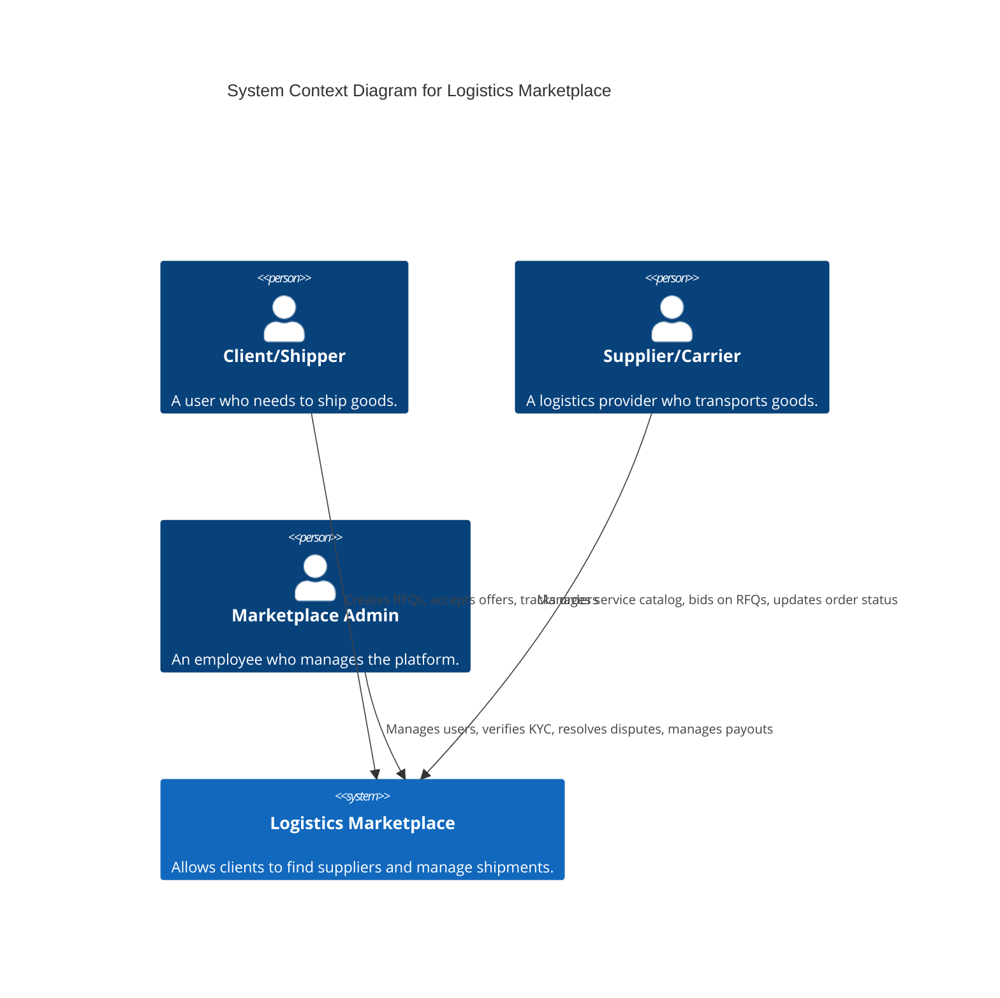

# C4 Model Architecture Diagrams

This document contains the System Context and Container diagrams for the Logistics Marketplace platform, following the C4 model methodology. The diagrams are created using Mermaid syntax.

## Level 1: System Context Diagram

The System Context diagram shows the highest level of abstraction: the users (actors) and their interaction with our software system.



## Level 2: Container Diagram

The Container diagram zooms into the "Logistics Marketplace" system, showing the high-level technical containers (applications, data stores, etc.) that make up the system.

```mermaid
C4Container
  title Container Diagram for Logistics Marketplace

  Person(client, "Client/Shipper", "Web, Mobile")
  Person(supplier, "Supplier/Carrier", "Web, Mobile")
  Person(admin, "Marketplace Admin", "Web")

  System_Boundary(c1, "Logistics Marketplace") {
    Container(frontend, "Web Application", "React, TypeScript", "The main frontend for all users, delivered via web browser.")
    Container(mobile, "Mobile App", "Flutter", "Provides core functionality for clients and suppliers on iOS and Android.")

    System_Boundary(c2, "Backend API (Microservices)") {
      Container(auth_service, "Auth Service", "FastAPI", "Handles user registration, login, roles, and KYC.")
      Container(orgs_service, "Orgs Service", "FastAPI", "Manages organizations, teams, and invitations.")
      Container(rfq_service, "RFQ Service", "FastAPI", "Manages RFQs and offers.")
      Container(orders_service, "Orders Service", "FastAPI", "Manages the order lifecycle and tracking.")
      Container(payments_service, "Payments Service", "FastAPI", "Handles invoices and payouts.")
      Container(catalog_service, "Catalog Service", "FastAPI", "Manages supplier service offerings.")
      Container(admin_service, "Admin Service", "FastAPI", "Provides administrative endpoints.")
      Container(chat_service, "Chat Service", "FastAPI, WebSocket", "Handles real-time chat.")
      Container(docs_service, "Docs Service", "FastAPI", "Manages document uploads.")
      Container(search_service, "Search Service", "FastAPI", "Provides search functionality.")
    }

    ContainerDb(postgres_db, "PostgreSQL DB", "Relational Database", "Stores core business data for all services.")
    ContainerDb(redis, "Redis", "In-memory Store", "Used for caching and session management.")
    ContainerDb(minio, "MinIO", "S3 Storage", "Stores user-uploaded documents (KYC, PODs).")
    ContainerDb(elasticsearch, "Elasticsearch", "Search Engine", "Powers the search functionality.")

    Container(kafka, "Kafka", "Message Bus", "Handles asynchronous communication between services.")
  }

  Rel(client, frontend, "Uses", "HTTPS")
  Rel(supplier, frontend, "Uses", "HTTPS")
  Rel(admin, frontend, "Uses", "HTTPS")

  Rel(client, mobile, "Uses", "HTTPS")
  Rel(supplier, mobile, "Uses", "HTTPS")

  Rel(frontend, auth_service, "API Calls", "HTTPS")
  Rel(frontend, orgs_service, "API Calls", "HTTPS")
  Rel.and(frontend, rfq_service, "API Calls", "HTTPS")
  Rel.and(frontend, orders_service, "API Calls", "HTTPS")
  Rel.and(frontend, payments_service, "API Calls", "HTTPS")
  Rel.and(frontend, catalog_service, "API Calls", "HTTPS")
  Rel.and(frontend, admin_service, "API Calls", "HTTPS")
  Rel(frontend, chat_service, "API Calls", "WSS")
  Rel(frontend, docs_service, "API Calls", "HTTPS")
  Rel(frontend, search_service, "API Calls", "HTTPS")

  Rel_Right(mobile, auth_service, "API Calls", "HTTPS")
  Rel_Right(mobile, rfq_service, "API Calls", "HTTPS")
  Rel_Right(mobile, orders_service, "API Calls", "HTTPS")

  Rel(auth_service, postgres_db, "Reads/Writes")
  Rel(orgs_service, postgres_db, "Reads/Writes")
  Rel(rfq_service, postgres_db, "Reads/Writes")
  Rel(orders_service, postgres_db, "Reads/Writes")
  Rel(payments_service, postgres_db, "Reads/Writes")
  Rel(catalog_service, postgres_db, "Reads/Writes")
  Rel(admin_service, postgres_db, "Reads/Writes")
  Rel(chat_service, postgres_db, "Reads/Writes")
  Rel(docs_service, postgres_db, "Reads/Writes")

  Rel(docs_service, minio, "Reads/Writes Files")

  Rel(search_service, elasticsearch, "Reads/Writes Indices")

  Rel(rfq_service, kafka, "Publishes 'offer_accepted'")
  Rel(orders_service, kafka, "Consumes 'offer_accepted', Publishes 'order_completed'")
  Rel(payments_service, kafka, "Consumes 'order_completed'")
  Rel(search_service, kafka, "Consumes events to index data")
```
