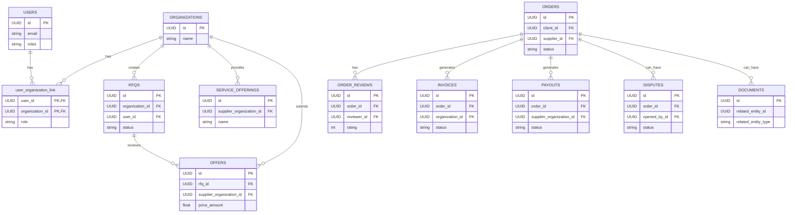

# Entity-Relationship Diagram

This document contains a high-level Entity-Relationship (ER) diagram for the Logistics Marketplace database. It shows the major entities and their relationships. Note that all services share the same database in this implementation, but the tables are logically grouped by service.

