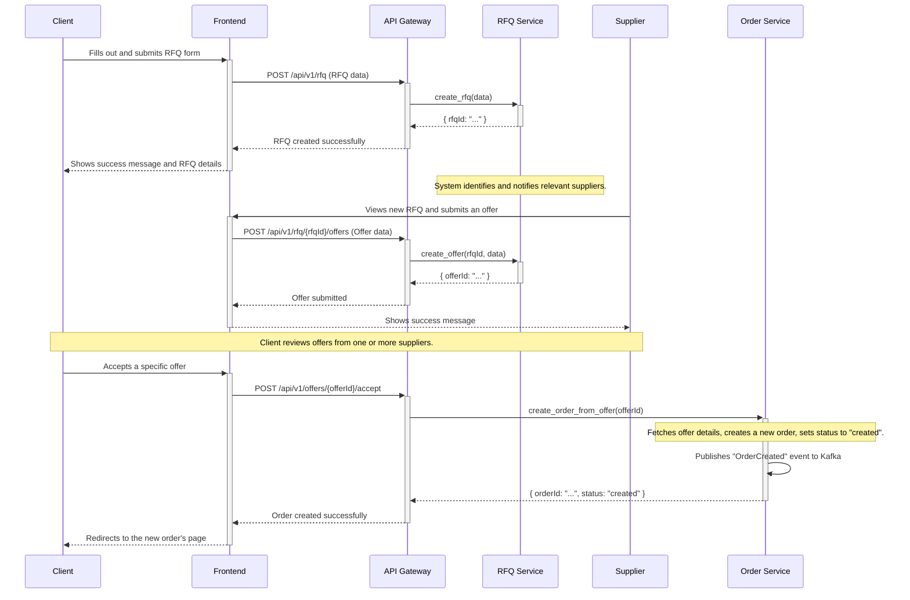
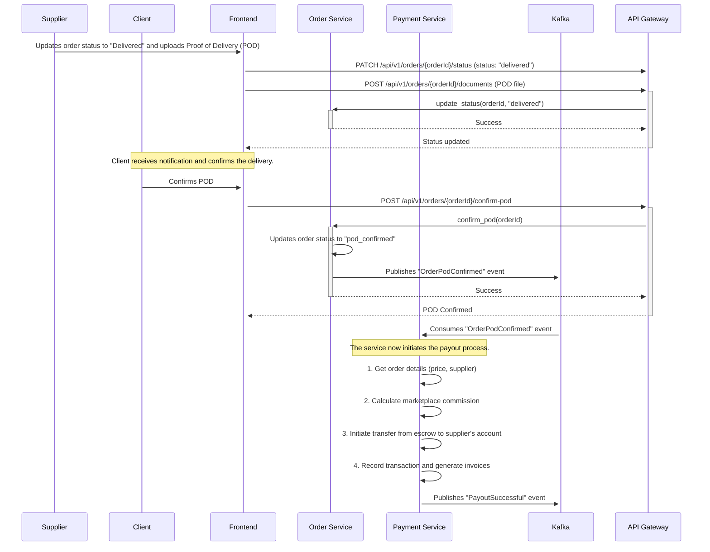

# Architecture Sequence Diagrams

This document contains sequence diagrams for key business processes in the Logistics Marketplace, as specified in the technical requirements. These diagrams are written in Mermaid syntax.

---

## 1. RFQ Creation and Order Booking Flow

This diagram illustrates the process from a client creating a Request for Quotation (RFQ) to a supplier's offer being accepted and an order being created.

---

## 2. Order Completion and Escrow Payment Flow

This diagram shows the process after an order is delivered, leading to the automatic payout to the supplier.

