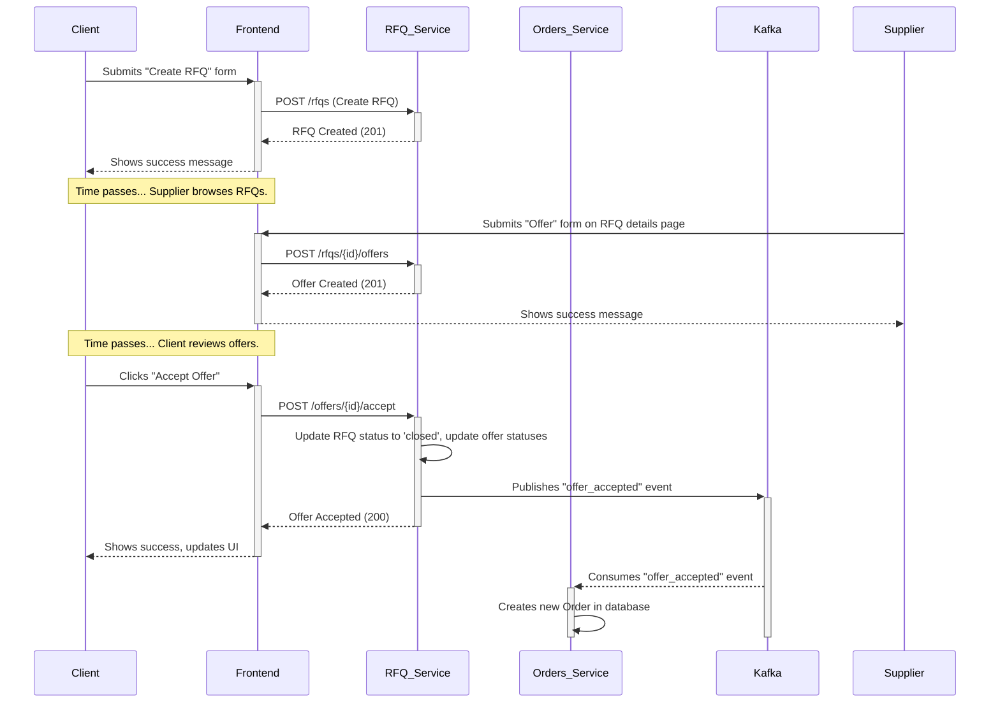
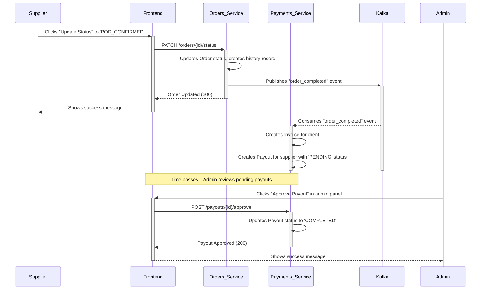

# Sequence Diagrams

This document illustrates the sequence of interactions between containers for key business flows.

## Flow 1: RFQ Creation to Order Creation

This diagram shows how a client creates an RFQ, a supplier bids on it, the client accepts the offer, and an order is created via an event-driven process.

## Flow 2: Order Completion and Payout

This diagram shows how an order being completed by a supplier triggers the invoicing and payout flow.

